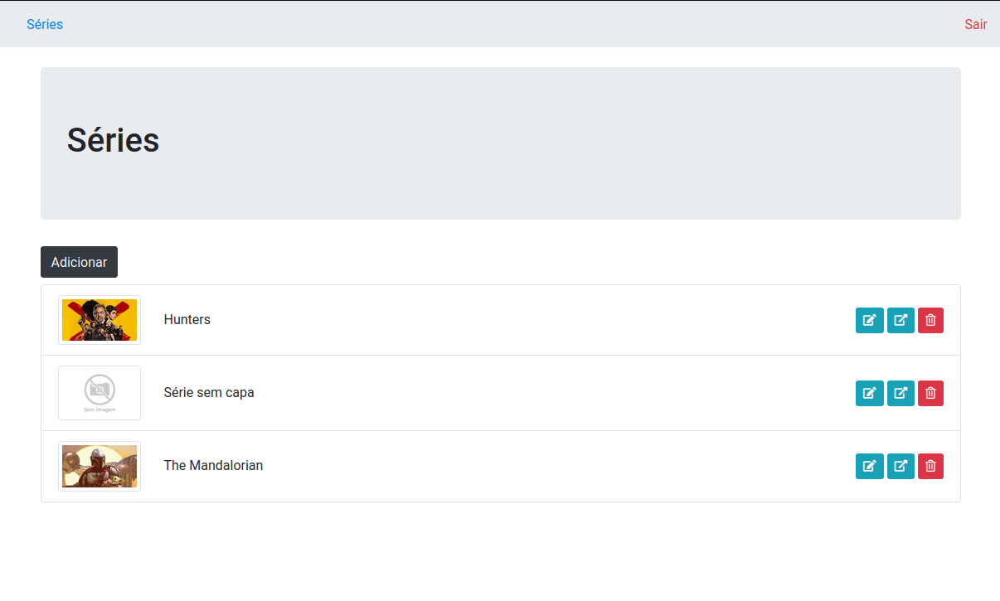
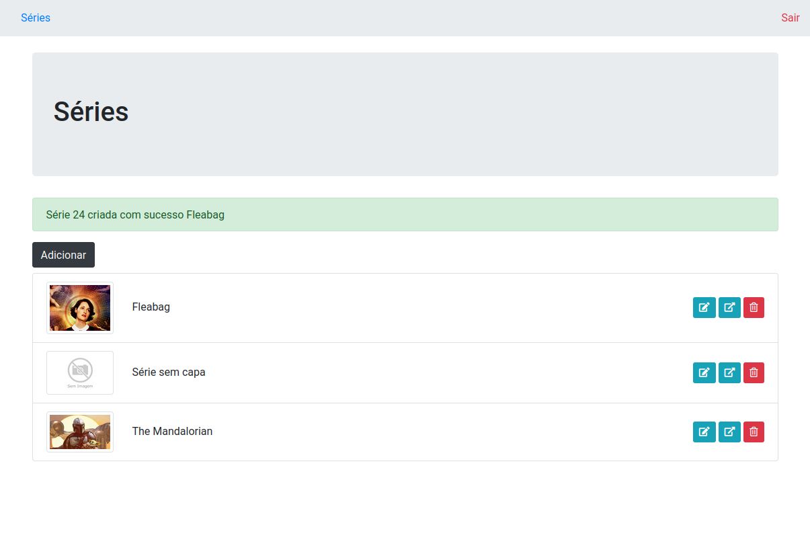

<h1 align="center">
    Gerenciador de Séries
</h1>
 


<p align="center">
  

  <a href="https://www.linkedin.com/in/amanda-zacharuk-23b530156/">
    
  </a>

  <a href="https://github.com/amandazk/gerenciador-de-series/commits/master">
    
  </a>


</p>


## :computer: Sobre o projeto

Gerenciador pessoal de séries de TV, onde o usuário cadastra as séries que acompanha, assim como as suas temporadas e episódios. É possível marcar os episódios como assistidos. 

Na aba Séries (/series):
 - O usuário é redirecionado para a listagem de séries. Se estiver logado, poderá fazer as alterações, como excluir, editar o nome da série e marcar episódios como assistidos.
   
Na aba Entrar (/entrar):
 - O usuário é redirecionado para o formulário de login. Se ainda não for cadastrado, poderá criar um novo usuário.


Projeto desenvolvido no curso do framework Laravel, da plataforma Alura.


### Web

<p align="center" style="display: flex; align-items: flex-start; justify-content: center;">
	
  

  
  
  
  
  
  
  
  
  
  
  
  
  

  
</p>

## :wrench: Tecnologias usadas

As seguintes ferramentas foram usadas na construção do projeto:

- [PHP][PHP]
- [Laravel][laravel]
- [CSS][CSS]
- [HTML][HTML]
- [SQLite][sqlite]


## :rocket: Como rodar o projeto
 
### Pré-requisitos

Antes de começar, é necessário ter instalado as seguintes ferramentas:
[Git](https://git-scm.com), [PHP][PHP], [Composer][composer]. 

### Rodando a aplicação 

```bash
# Clone este repositório
$ git clone https://github.com/amandazk/gerenciador-de-series.git

# Acesse a pasta do projeto no terminal
$ cd gerenciador-de-series

# Instale as dependências
$ composer install

# Depois de instalar as dependências, rodar o comando para rodar as migrations
$ php artisan migrate

# Execute a aplicação em modo de desenvolvimento
$ php artisan serve
```


[PHP]: https://www.php.net/
[laravel]: https://laravel.com/
[CSS]: https://developer.mozilla.org/pt-BR/docs/Web/CSS
[HTML]: https://developer.mozilla.org/pt-BR/docs/Web/HTML
[sqlite]: https://www.sqlite.org/index.html
[composer]: https://getcomposer.org/
